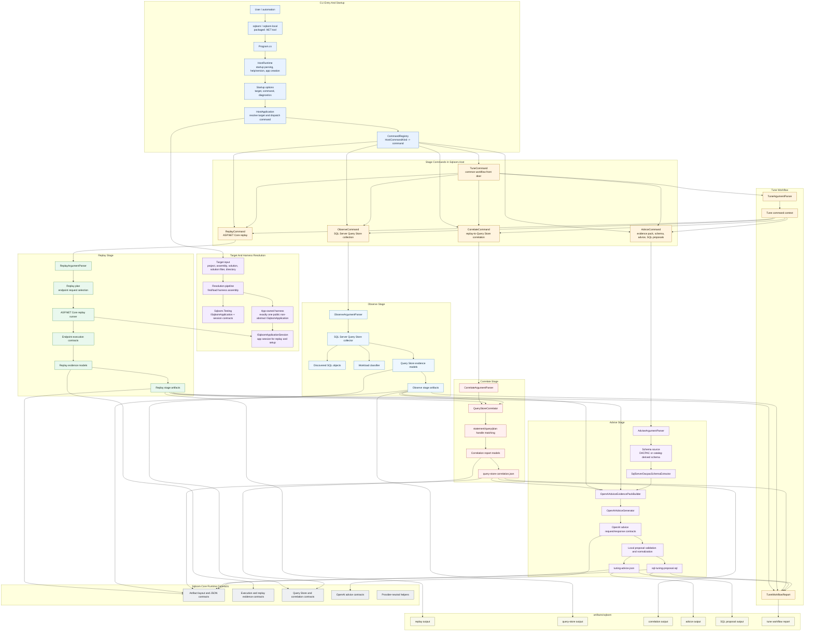

# Sqloom Map

Resident architecture context for first-pass navigation. Atlas stores durable routing facts only; use `git ls-files`, `rg`, RoslynKit live commands, tests, generated artifacts, and direct file reads for current facts.

## Shape

- Solution: [Sqloom.slnx](../../Sqloom.slnx)
- Focused solution filters: [Sqloom.UnitTests.slnf](../../Sqloom.UnitTests.slnf), [Sqloom.IntegrationTests.slnf](../../Sqloom.IntegrationTests.slnf)
- Production: [src/Sqloom.Core/](../../src/Sqloom.Core/), [src/Sqloom.Testing/](../../src/Sqloom.Testing/), [src/Sqloom.Host/](../../src/Sqloom.Host/)
- Tests and sample harness: [tests/Sqloom.UnitTests/](../../tests/Sqloom.UnitTests/), [tests/Sqloom.IntegrationTests/](../../tests/Sqloom.IntegrationTests/), [tests/Sqloom.TestApp/](../../tests/Sqloom.TestApp/), [tests/Sqloom.TestApp.Harness/](../../tests/Sqloom.TestApp.Harness/)
- Docs and tooling: [README.md](../../README.md), [docs/](../../docs/), [scripts/](../../scripts/)
- Generated artifacts: `artifacts/sqloom/`
- Agent assets: [AGENTS.md](../../AGENTS.md), [.agents/skills/roslynkit/](../../.agents/skills/roslynkit/), [.agents/skills/roslynkit/references/commands.md](../../.agents/skills/roslynkit/references/commands.md), [.agents/skills/roslynkit/references/output.md](../../.agents/skills/roslynkit/references/output.md), [.agents/skills/security-audit/SKILL.md](../../.agents/skills/security-audit/SKILL.md), [.codex/agents/](../agents/), [.codex/atlas/repo-map.md](repo-map.md)

## Runtime Diagram

## Runtime Flow

- User-facing pipeline: `replay -> observe -> correlate -> advise`.
- Convenience front door: `tune` runs the common workflow and writes stage-owned artifacts under `artifacts/sqloom/`.
- [src/Sqloom.Host/Program.cs](../../src/Sqloom.Host/Program.cs) calls `HostRuntime.RunAsync`.
- [src/Sqloom.Host/HostRuntime.cs](../../src/Sqloom.Host/HostRuntime.cs) parses startup options, handles help/version, creates `HostApplication`, and delegates command execution.
- [src/Sqloom.Host/Dispatch/HostApplication.cs](../../src/Sqloom.Host/Dispatch/HostApplication.cs) resolves the selected harness or bound `ISqloomApplication`, chooses a `HostCommandKind`, creates command context, and dispatches through `CommandRegistry`.
- Stage commands own their stage behavior: [src/Sqloom.Host/ReplayCommand.cs](../../src/Sqloom.Host/ReplayCommand.cs), [src/Sqloom.Host/ObserveCommand.cs](../../src/Sqloom.Host/ObserveCommand.cs), [src/Sqloom.Host/CorrelateCommand.cs](../../src/Sqloom.Host/CorrelateCommand.cs), [src/Sqloom.Host/AdviceCommand.cs](../../src/Sqloom.Host/AdviceCommand.cs), and [src/Sqloom.Host/TuneCommand.cs](../../src/Sqloom.Host/TuneCommand.cs).

## Domains

- CLI dispatch and startup: [src/Sqloom.Host/Program.cs](../../src/Sqloom.Host/Program.cs), [src/Sqloom.Host/HostRuntime.cs](../../src/Sqloom.Host/HostRuntime.cs), [src/Sqloom.Host/Startup/](../../src/Sqloom.Host/Startup/), [src/Sqloom.Host/Dispatch/](../../src/Sqloom.Host/Dispatch/), [src/Sqloom.Host/Output/HostConsoleWriter.cs](../../src/Sqloom.Host/Output/HostConsoleWriter.cs); tests usually start in [tests/Sqloom.UnitTests/Host/HostStartupCommandLineTests.cs](../../tests/Sqloom.UnitTests/Host/HostStartupCommandLineTests.cs), [tests/Sqloom.UnitTests/Host/HostApplicationTests.cs](../../tests/Sqloom.UnitTests/Host/HostApplicationTests.cs), and [tests/Sqloom.IntegrationTests/Host/HostProcessTests.cs](../../tests/Sqloom.IntegrationTests/Host/HostProcessTests.cs).
- Replay: [src/Sqloom.Host/ReplayCommand.cs](../../src/Sqloom.Host/ReplayCommand.cs), [src/Sqloom.Host/ReplayArgumentParser.cs](../../src/Sqloom.Host/ReplayArgumentParser.cs), [src/Sqloom.Host/Replay/](../../src/Sqloom.Host/Replay/), endpoint execution contracts in [src/Sqloom.Core/Execution/](../../src/Sqloom.Core/Execution/); tests usually start in [tests/Sqloom.UnitTests/Host/ReplayArgumentParserTests.cs](../../tests/Sqloom.UnitTests/Host/ReplayArgumentParserTests.cs), [tests/Sqloom.UnitTests/Endpoints/EndpointReplayPlanBuilderTests.cs](../../tests/Sqloom.UnitTests/Endpoints/EndpointReplayPlanBuilderTests.cs), [tests/Sqloom.UnitTests/Endpoints/EndpointReplayRequestResolverTests.cs](../../tests/Sqloom.UnitTests/Endpoints/EndpointReplayRequestResolverTests.cs), [tests/Sqloom.UnitTests/Endpoints/EndpointReplayRunnerTests.cs](../../tests/Sqloom.UnitTests/Endpoints/EndpointReplayRunnerTests.cs), and [tests/Sqloom.IntegrationTests/Host/HostRuntimeTests.cs](../../tests/Sqloom.IntegrationTests/Host/HostRuntimeTests.cs).
- Observe and Query Store: [src/Sqloom.Host/ObserveCommand.cs](../../src/Sqloom.Host/ObserveCommand.cs), [src/Sqloom.Host/ObserveArgumentParser.cs](../../src/Sqloom.Host/ObserveArgumentParser.cs), [src/Sqloom.Host/QueryStore/](../../src/Sqloom.Host/QueryStore/), Query Store contracts in [src/Sqloom.Core/QueryStore/](../../src/Sqloom.Core/QueryStore/); tests usually start in [tests/Sqloom.UnitTests/Host/ObserveArgumentParserTests.cs](../../tests/Sqloom.UnitTests/Host/ObserveArgumentParserTests.cs), [tests/Sqloom.UnitTests/QueryStore/SqlServerQueryStoreCollectorTests.cs](../../tests/Sqloom.UnitTests/QueryStore/SqlServerQueryStoreCollectorTests.cs), [tests/Sqloom.UnitTests/QueryStore/SqlServerDiscoveredObjectCollectorTests.cs](../../tests/Sqloom.UnitTests/QueryStore/SqlServerDiscoveredObjectCollectorTests.cs), and [tests/Sqloom.UnitTests/QueryStore/WorkloadClassifierTests.cs](../../tests/Sqloom.UnitTests/QueryStore/WorkloadClassifierTests.cs).
- Correlate: [src/Sqloom.Host/CorrelateCommand.cs](../../src/Sqloom.Host/CorrelateCommand.cs), [src/Sqloom.Host/CorrelateArgumentParser.cs](../../src/Sqloom.Host/CorrelateArgumentParser.cs), [src/Sqloom.Host/QueryStore/QueryStoreCorrelator.cs](../../src/Sqloom.Host/QueryStore/QueryStoreCorrelator.cs), correlation contracts in [src/Sqloom.Core/QueryStore/](../../src/Sqloom.Core/QueryStore/); tests usually start in [tests/Sqloom.UnitTests/Host/CorrelateArgumentParserTests.cs](../../tests/Sqloom.UnitTests/Host/CorrelateArgumentParserTests.cs), [tests/Sqloom.UnitTests/QueryStore/QueryStoreCorrelatorTests.cs](../../tests/Sqloom.UnitTests/QueryStore/QueryStoreCorrelatorTests.cs), and [tests/Sqloom.UnitTests/QueryStore/QueryStoreCorrelationAdvisorTests.cs](../../tests/Sqloom.UnitTests/QueryStore/QueryStoreCorrelationAdvisorTests.cs).
- Advise and SQL proposals: [src/Sqloom.Host/AdviceCommand.cs](../../src/Sqloom.Host/AdviceCommand.cs), [src/Sqloom.Host/AdviseArgumentParser.cs](../../src/Sqloom.Host/AdviseArgumentParser.cs), [src/Sqloom.Host/Providers/OpenAIAdviceGenerator.cs](../../src/Sqloom.Host/Providers/OpenAIAdviceGenerator.cs), [src/Sqloom.Host/Providers/OpenAIAdviceEvidencePackBuilder.cs](../../src/Sqloom.Host/Providers/OpenAIAdviceEvidencePackBuilder.cs), [src/Sqloom.Host/SqlServerDacpacSchemaExtractor.cs](../../src/Sqloom.Host/SqlServerDacpacSchemaExtractor.cs), advice contracts in [src/Sqloom.Core/Execution/](../../src/Sqloom.Core/Execution/) and [src/Sqloom.Core/OpenAI/](../../src/Sqloom.Core/OpenAI/); tests usually start in [tests/Sqloom.UnitTests/Host/AdviseArgumentParserTests.cs](../../tests/Sqloom.UnitTests/Host/AdviseArgumentParserTests.cs), [tests/Sqloom.UnitTests/Host/AdviceCommandTests.cs](../../tests/Sqloom.UnitTests/Host/AdviceCommandTests.cs), [tests/Sqloom.UnitTests/Host/OpenAIAdviceGeneratorTests.cs](../../tests/Sqloom.UnitTests/Host/OpenAIAdviceGeneratorTests.cs), and [tests/Sqloom.UnitTests/Host/SqlServerDacpacSchemaExtractorTests.cs](../../tests/Sqloom.UnitTests/Host/SqlServerDacpacSchemaExtractorTests.cs).
- Tune workflow: [src/Sqloom.Host/TuneCommand.cs](../../src/Sqloom.Host/TuneCommand.cs), [src/Sqloom.Host/TuneArgumentParser.cs](../../src/Sqloom.Host/TuneArgumentParser.cs), [src/Sqloom.Host/TuneWorkflowReport.cs](../../src/Sqloom.Host/TuneWorkflowReport.cs), plus replay, observe, correlate, and advise domains; tests usually start in [tests/Sqloom.UnitTests/Host/TuneArgumentParserTests.cs](../../tests/Sqloom.UnitTests/Host/TuneArgumentParserTests.cs), [tests/Sqloom.IntegrationTests/Host/HostRuntimeTests.cs](../../tests/Sqloom.IntegrationTests/Host/HostRuntimeTests.cs), and [tests/Sqloom.IntegrationTests/Host/HostCatalogAdviceTests.cs](../../tests/Sqloom.IntegrationTests/Host/HostCatalogAdviceTests.cs).
- Artifact and JSON contracts: [src/Sqloom.Core/Artifacts/](../../src/Sqloom.Core/Artifacts/), persisted models under [src/Sqloom.Core/Execution/](../../src/Sqloom.Core/Execution/) and [src/Sqloom.Core/QueryStore/](../../src/Sqloom.Core/QueryStore/), and [src/Sqloom.Host/TuneWorkflowReport.cs](../../src/Sqloom.Host/TuneWorkflowReport.cs); tests usually start in [tests/Sqloom.UnitTests/Artifacts/ArtifactLayoutTests.cs](../../tests/Sqloom.UnitTests/Artifacts/ArtifactLayoutTests.cs) and [tests/Sqloom.UnitTests/Artifacts/JsonContractTests.cs](../../tests/Sqloom.UnitTests/Artifacts/JsonContractTests.cs).
- Harness model: [src/Sqloom.Testing/](../../src/Sqloom.Testing/), [tests/Sqloom.TestApp/](../../tests/Sqloom.TestApp/), [tests/Sqloom.TestApp.Harness/](../../tests/Sqloom.TestApp.Harness/), and host resolution under [src/Sqloom.Host/Resolution/](../../src/Sqloom.Host/Resolution/); tests usually start in [tests/Sqloom.UnitTests/Host/AppResolverTests.cs](../../tests/Sqloom.UnitTests/Host/AppResolverTests.cs), [tests/Sqloom.UnitTests/Host/TestAppIntegrations.cs](../../tests/Sqloom.UnitTests/Host/TestAppIntegrations.cs), [tests/Sqloom.IntegrationTests/Host/HostSeedScriptTests.cs](../../tests/Sqloom.IntegrationTests/Host/HostSeedScriptTests.cs), and [tests/Sqloom.IntegrationTests/Host/HostCatalogAdviceTests.cs](../../tests/Sqloom.IntegrationTests/Host/HostCatalogAdviceTests.cs).
- Packaging and local tooling: [src/Sqloom.Host/Sqloom.Host.csproj](../../src/Sqloom.Host/Sqloom.Host.csproj), [src/Sqloom.Host/PackageReadme.md](../../src/Sqloom.Host/PackageReadme.md), [scripts/Sqloom.Tooling.ps1](../../scripts/Sqloom.Tooling.ps1), [scripts/deploy-sqloom-local.ps1](../../scripts/deploy-sqloom-local.ps1), [docs/dotnet-tool-release.md](../../docs/dotnet-tool-release.md), and [docs/command-reference.md](../../docs/command-reference.md).
- Agent/navigation policy: [AGENTS.md](../../AGENTS.md), [docs/agents/README.md](../../docs/agents/README.md), [.codex/agents/](../agents/), [.codex/atlas/repo-map.md](repo-map.md), and [.agents/skills/roslynkit/](../../.agents/skills/roslynkit/).

## Test Routing

- CLI startup, command dispatch, and help/version output -> [tests/Sqloom.UnitTests/Host/HostStartupCommandLineTests.cs](../../tests/Sqloom.UnitTests/Host/HostStartupCommandLineTests.cs), [tests/Sqloom.UnitTests/Host/HostApplicationTests.cs](../../tests/Sqloom.UnitTests/Host/HostApplicationTests.cs), [tests/Sqloom.IntegrationTests/Host/HostProcessTests.cs](../../tests/Sqloom.IntegrationTests/Host/HostProcessTests.cs)
- Parser changes -> matching `*ArgumentParserTests.cs` under [tests/Sqloom.UnitTests/Host/](../../tests/Sqloom.UnitTests/Host/)
- Replay planning and request execution -> [tests/Sqloom.UnitTests/Endpoints/](../../tests/Sqloom.UnitTests/Endpoints/), [tests/Sqloom.UnitTests/Host/ReplayArgumentParserTests.cs](../../tests/Sqloom.UnitTests/Host/ReplayArgumentParserTests.cs), [tests/Sqloom.IntegrationTests/Host/HostRuntimeTests.cs](../../tests/Sqloom.IntegrationTests/Host/HostRuntimeTests.cs)
- Query Store collection and classification -> [tests/Sqloom.UnitTests/QueryStore/](../../tests/Sqloom.UnitTests/QueryStore/)
- Correlation -> [tests/Sqloom.UnitTests/QueryStore/QueryStoreCorrelatorTests.cs](../../tests/Sqloom.UnitTests/QueryStore/QueryStoreCorrelatorTests.cs), [tests/Sqloom.UnitTests/QueryStore/QueryStoreCorrelationAdvisorTests.cs](../../tests/Sqloom.UnitTests/QueryStore/QueryStoreCorrelationAdvisorTests.cs), [tests/Sqloom.UnitTests/Host/CorrelateArgumentParserTests.cs](../../tests/Sqloom.UnitTests/Host/CorrelateArgumentParserTests.cs)
- Advice, OpenAI evidence, DACPAC schema extraction, and SQL proposals -> [tests/Sqloom.UnitTests/Host/AdviceCommandTests.cs](../../tests/Sqloom.UnitTests/Host/AdviceCommandTests.cs), [tests/Sqloom.UnitTests/Host/OpenAIAdviceGeneratorTests.cs](../../tests/Sqloom.UnitTests/Host/OpenAIAdviceGeneratorTests.cs), [tests/Sqloom.UnitTests/Host/SqlServerDacpacSchemaExtractorTests.cs](../../tests/Sqloom.UnitTests/Host/SqlServerDacpacSchemaExtractorTests.cs), [tests/Sqloom.IntegrationTests/Host/HostCatalogAdviceTests.cs](../../tests/Sqloom.IntegrationTests/Host/HostCatalogAdviceTests.cs)
- Artifacts and public JSON contracts -> [tests/Sqloom.UnitTests/Artifacts/](../../tests/Sqloom.UnitTests/Artifacts/)
- Packaging and local tool behavior -> [scripts/](../../scripts/), [docs/dotnet-tool-release.md](../../docs/dotnet-tool-release.md), [README.md](../../README.md), plus build/pack/local-wrapper smoke commands

## Commands

- Restore: `dotnet restore .\Sqloom.slnx`
- Build: `dotnet build .\Sqloom.slnx --tl:off --nologo "-clp:ErrorsOnly;NoSummary"`
- Unit tests: `dotnet test --solution .\Sqloom.UnitTests.slnf`
- Integration tests: `dotnet test --solution .\Sqloom.IntegrationTests.slnf`
- Local tool deploy: `pwsh .\scripts\deploy-sqloom-local.ps1`
- Local tool smoke: `sqloom-local --version`

## Navigation Rules

- Follow the runtime flow first for command behavior, then use RoslynKit or direct line reads for the narrow unclear hop.
- Read nearby tests before implementation when a matching test exists.
- For public CLI, JSON artifact, package, configuration, or documented workflow changes, update [README.md](../../README.md) or the relevant docs in the same change.
- Inspect `artifacts/sqloom/` before guessing about replay, correlate, advise, or tune behavior from code alone.
- Use [.agents/skills/roslynkit/SKILL.md](../../.agents/skills/roslynkit/SKILL.md) for C# semantic inspection when the current environment exposes RoslynKit and the task benefits from symbols, definitions, references, implementations, quick info, or line-range reads.
- Do not use Atlas as a file inventory, test inventory, symbol graph, reference graph, artifact cache, or source cache.
- Ignore first: `artifacts/`, `TestResults/`, `.vs/`, `.tools/`, `bin/`, `obj/`, and package output unless the task is explicitly about generated artifacts, local tooling, or packaging.

Last verified: `2026-07-07`
