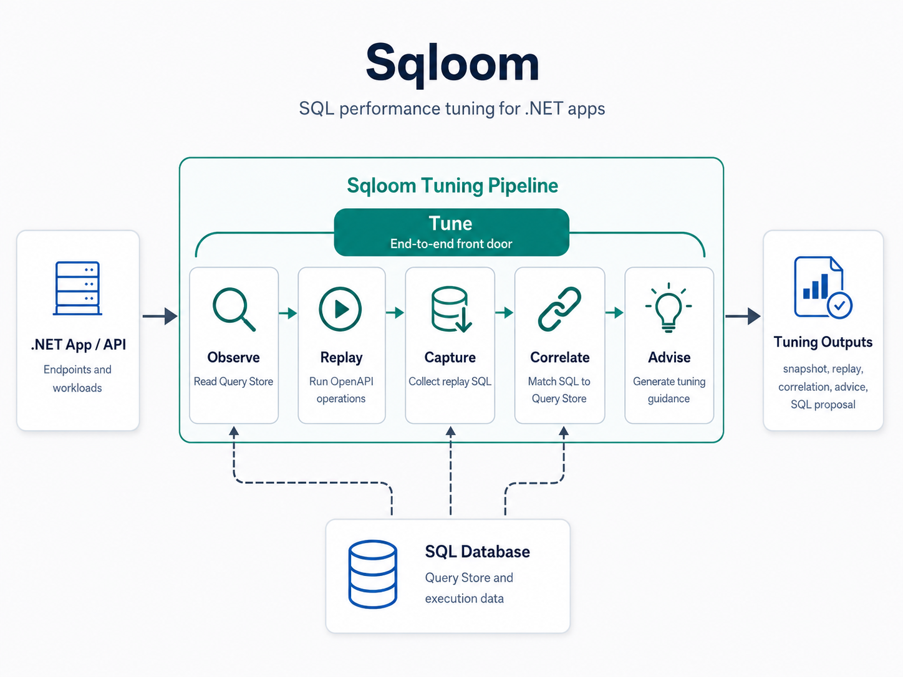

# Sqloom

Sqloom helps you find slow database work behind API requests in a .NET app. It replays an API operation through an app-owned harness, reads SQL Server or Azure SQL Query Store, matches the captured SQL back to Query Store evidence, and writes tuning advice plus SQL proposal files.

Most users start with `sqloom tune`. It runs the full workflow:

```text
replay -> observe -> correlate -> advise
```

This repo includes a sample app and harness for `GET /api/products/by-category`. The harness starts a throwaway SQL Server database from `AdventureWorksLT2025.dacpac`, seeds the data needed for the sample product query, and supplies the replay and schema defaults Sqloom needs.



## Install

Install the public tool from NuGet.org:

```powershell
dotnet tool install --global sqloom
sqloom --help
```

Update an existing install with:

```powershell
dotnet tool update --global sqloom
```

## Quick Start

Run the sample `tune` workflow from the repo root:

```powershell
if (-not $env:OPENAI_API_KEY) { throw "OPENAI_API_KEY is required." }

sqloom tune .\tests\Sqloom.TestApp.Harness\Sqloom.TestApp.Harness.csproj `
 --target "GET /api/products/by-category" `
 --model-provider openai `
 --openai-api-key $env:OPENAI_API_KEY `
 --openai-model "gpt-5.5" `
 --debug
```

That command starts the sample harness, replays the selected API request, captures the SQL it caused, reads Query Store from the replay database, correlates the captured SQL to Query Store rows, and asks OpenAI for operation-level tuning advice. `--debug` prints stage details to `stderr`, including redacted OpenAI request and response details during the advice step.

The run writes a timestamped folder under `artifacts/sqloom/tune/`, including:

- `query-store-snapshot.json`
- `tune-summary.json`
- `replay/query-store-correlation.json`
- `replay/sqlserver-schema.sql`
- `replay/tuning-advice.json`
- `replay/sql-tuning-proposal.json`
- `replay/sql-tuning-proposal.sql`

The important review artifact is usually `replay/sql-tuning-proposal.sql`, with the JSON files available when you want the full evidence chain.

## Commands

Sqloom has one common front door and four lower-level stages:

- `tune`: run `replay -> observe -> correlate -> advise` in one command.
- `replay`: run API operations through an `ISqloomApplication` harness and capture SQL.
- `observe`: read recent Query Store data from SQL Server or Azure SQL.
- `correlate`: match replay-captured SQL back to a Query Store snapshot.
- `advise`: turn replay, correlation, and schema evidence into tuning advice and SQL proposal files.

See [docs/command-reference.md](docs/command-reference.md) for the exhaustive command syntax, arguments, defaults, outputs, and advanced options such as explicit DACPAC, seed, schema, and read-only connection overrides.

## How It Fits Into An App

Sqloom stays generic. Your app supplies a small harness project that references `Sqloom.Testing` and exposes exactly one public non-abstract `ISqloomApplication`. The harness tells Sqloom where the app-owned OpenAPI document lives, how to start the app for replay, and which replay defaults are safe for that app.

In this repo:

- `src/Sqloom.Core` owns shared contracts and persisted artifact models.
- `src/Sqloom.Testing` is the public package used by app harnesses.
- `src/Sqloom.Host` owns the CLI, harness loading, replay, Query Store collection, correlation, schema extraction, and advice generation.
- `tests/Sqloom.TestApp.Harness` is the sample app-specific harness used by the quick start.

For more detail about repo layout and boundaries, see [docs/architecture/overview.md](docs/architecture/overview.md) and [docs/architecture/dependencies.md](docs/architecture/dependencies.md).

## Build And Test

Build from the repo root:

```powershell
dotnet restore .\Sqloom.slnx
dotnet build .\Sqloom.slnx --tl:off --nologo "-clp:ErrorsOnly;NoSummary"
```

Run the test lanes:

```powershell
dotnet test --solution .\Sqloom.UnitTests.slnf
dotnet test --solution .\Sqloom.IntegrationTests.slnf
```

Use `sqloom-local` only when you are changing Sqloom itself and want a local tool install separate from the public `sqloom` command:

```powershell
pwsh .\scripts\deploy-sqloom-local.ps1
sqloom-local --version
```

For package preparation and release workflow, see [docs/dotnet-tool-release.md](docs/dotnet-tool-release.md).
