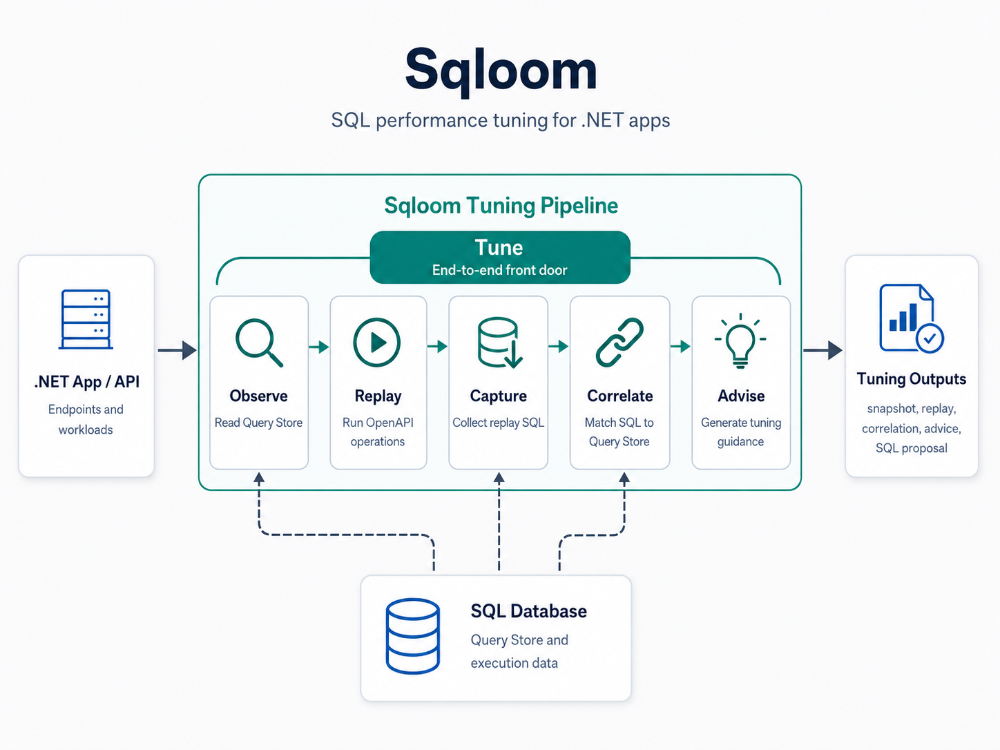

# Sqloom

Sqloom helps you find slow database work behind API requests in a .NET app. It runs a selected API request inside your app's test harness, captures the SQL that request executes, reads SQL Server or Azure SQL Query Store, matches the captured SQL back to Query Store evidence, and writes tuning advice plus SQL proposal files.

Most users start with `sqloom tune`. It runs the full workflow:

```text
replay -> observe -> correlate -> advise
```

This repo includes a sample app and harness for `GET /api/products/by-category`. The SQL-backed quick start expects `AdventureWorksLT2025` to exist on the local SQL Server instance; Sqloom exports the schema DACPAC from the supplied connection string during the run.



## Install

Install the public tool from NuGet.org:

```powershell
dotnet tool install --global sqloom
sqloom --help
```

Update an existing install with:

```powershell
dotnet tool update --global sqloom
```

## Quick Start

Set `OPENAI_API_KEY`, make sure `AdventureWorksLT2025` is restored on your local SQL Server, then run the sample `tune` workflow from the repo root. The connection string is used for the sample app replay, Query Store reads, and DACPAC/schema extraction.

```powershell
sqloom-local tune .\tests\Sqloom.TestApp.Harness\Sqloom.TestApp.Harness.csproj `
 --target "GET /api/products/by-category" `
 --read-only-connection-string "Server=localhost;Database=AdventureWorksLT2025;Integrated Security=True;TrustServerCertificate=True;MultipleActiveResultSets=True" `
 --model-provider openai `
 --openai-api-key $env:OPENAI_API_KEY `
 --openai-model "gpt-5.4-mini" `
 --debug
```

That command starts the sample harness against the local `AdventureWorksLT2025` database, runs the selected API request, captures the SQL it caused, reads Query Store through the supplied connection string, correlates the captured SQL to Query Store rows, and asks OpenAI for operation-level tuning advice. Because no sample DACPAC is checked in, `tune` exports `replay/sqlserver-schema-source.dacpac` from the connection string and extracts `replay/sqlserver-schema.sql` for advice. `--sqlserver-dacpac-file` remains an expert schema-source override, `--sqlserver-seed-sql-file` remains available for custom harnesses that consume it, and `--sqlserver-schema-file` remains the advice-only schema SQL override. `--debug` prints stage details to `stderr`, including redacted OpenAI request and response details during the advice step.

The run writes a timestamped folder under `artifacts/sqloom/tune/`, including:

- `query-store-snapshot.json`
- `tune-summary.json`
- `replay/replay-data-prep.json`
- `replay/query-store-correlation.json`
- `replay/sqlserver-schema-source.dacpac` when Sqloom exports the schema source from the read-only connection
- `replay/sqlserver-dacpac-extract/model.sql` when schema is extracted from a DACPAC
- `replay/sqlserver-schema.sql`
- `replay/tuning-advice.json`
- `replay/sql-tuning-proposal.json`
- `replay/sql-tuning-proposal.sql`

The important review artifact is usually `replay/sql-tuning-proposal.sql`, with the JSON files available when you want the full evidence chain.

Sqloom uses Microsoft Agent Framework with OpenAI by default to fill missing replay path, query, header, and body values before the replay stage. Pass `--openai-api-key` for the agent call; pass `--replay-data-agent off` only when you want to opt out and rely entirely on harness-supplied replay values.

## Commands

Sqloom has one setup command, one common front door, and four lower-level stages:

- `init`: scaffold the `sqloom` agent skill into this repository.
- `tune`: run `replay -> observe -> correlate -> advise` in one command.
- `replay`: run API operations through an `ISqloomApplication` harness and capture SQL.
- `observe`: read recent Query Store data from SQL Server or Azure SQL.
- `correlate`: match replay-captured SQL back to a Query Store snapshot.
- `advise`: turn replay, correlation, and schema evidence into tuning advice and SQL proposal files.

See [docs/command-reference.md](docs/command-reference.md) for the exhaustive command syntax, arguments, defaults, outputs, and additional options.

## How It Fits Into An App

Sqloom stays generic. Your app supplies a small harness project that exposes exactly one public non-abstract `ISqloomApplication`. The harness tells Sqloom where the app-owned OpenAPI document lives, how to start the app for replay, and which replay defaults are safe for that app.

In this repo:

- [src/Sqloom.Core](src/Sqloom.Core) owns shared contracts and persisted artifact models.
- [src/Sqloom.Testing](src/Sqloom.Testing) owns harness contracts and ASP.NET Core capture helpers.
- [src/Sqloom.Host](src/Sqloom.Host) owns the CLI, harness loading, replay, Query Store collection, correlation, schema extraction, and advice generation.
- [tests/Sqloom.TestApp.Harness](tests/Sqloom.TestApp.Harness) is the sample app-specific harness used by the quick start.

For more detail about repo layout and boundaries, see [docs/architecture/overview.md](docs/architecture/overview.md) and [docs/architecture/dependencies.md](docs/architecture/dependencies.md).

## Build And Test

Build from the repo root:

```powershell
dotnet restore .\Sqloom.slnx
dotnet build .\Sqloom.slnx --tl:off --nologo "-clp:ErrorsOnly;NoSummary"
```

Run the test lanes:

```powershell
dotnet test --solution .\Sqloom.UnitTests.slnf
dotnet test --solution .\Sqloom.IntegrationTests.slnf
```

Use `sqloom-local` only when you are changing Sqloom itself and want a local tool install separate from the public `sqloom` command:

```powershell
pwsh .\scripts\deploy-sqloom-local.ps1
sqloom-local --version
```

For package preparation and release workflow, see [docs/dotnet-tool-release.md](docs/dotnet-tool-release.md).
