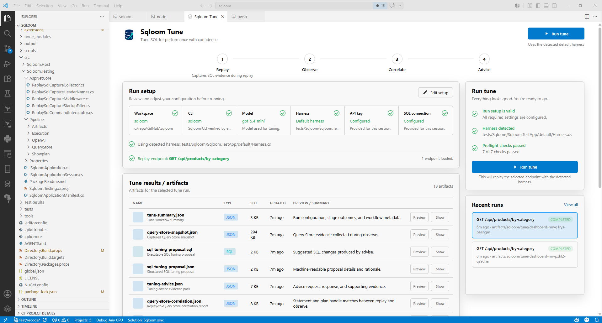

# Sqloom Preview

Sqloom for Visual Studio Code runs the existing `sqloom` CLI from a workspace UI. The Activity Bar logo opens a compact Sqloom webview launcher, and the launcher opens the Sqloom Tune dashboard preview inside the editor.

## Requirements

- Install the `sqloom` .NET tool and make sure the `sqloom` command is on `PATH`.
- Use a workspace that contains a Sqloom harness or can be initialized with `Sqloom: Initialize Sqloom Agent Skill`.
- Enter an OpenAI API key in the Tune dashboard, or set `OPENAI_API_KEY` before using dashboard or Command Palette tune runs.

## Features

- Open the Sqloom Tune dashboard preview from the Activity Bar logo or Command Palette.
- Use a dashboard-only masked OpenAI API key field that prefills from `OPENAI_API_KEY` when the VS Code extension host receives it.
- Enter a required dashboard-only masked read-only SQL Server connection string. The detected Sqloom test-app harness prefills its localhost Integrated Security connection for local development.
- Choose the model provider and OpenAI advice model from dashboard dropdowns before running tune.
- Load replayable operations from `sqloom endpoints`, choose one endpoint explicitly, and pass its stable operation key to dashboard tune runs as `--target`.
- The dashboard OpenAI model choices are `gpt-5.4`, `gpt-5.4-mini`, `gpt-5.5`, `gpt-5.6-sol`, `gpt-5.6-terra`, and `gpt-5.6-luna`.
- Run `sqloom init` for Codex, Claude, Copilot, or all supported agent skill locations.
- Run `sqloom tune` from the Command Palette.

## Settings

- `sqloom.cli.path`: Sqloom CLI executable or absolute path. Defaults to `sqloom`; the dashboard verifies this path with `--version` before marking the CLI ready.
- `sqloom.openai.model`: OpenAI model passed to `sqloom tune`. Defaults to `gpt-5.4-mini`.
- `sqloom.replayDataAgent`: Replay data agent mode passed to `sqloom tune`. Defaults to `required`.

## Preview Notes

This preview keeps the CLI as the complete workflow engine. The dashboard loads endpoint choices from the selected CLI and harness, keeps the choice only for the open dashboard session, and clears it when that context changes. Dashboard-entered API keys and read-only SQL Server connection strings are masked, are not stored in VS Code settings, and are passed only to the current CLI run. When the repository's test-app harness is detected, dashboard and Command Palette tune flows prefill its localhost connection string without storing it. When `OPENAI_API_KEY` is available to VS Code, the dashboard prefills the masked API key field from it, and dashboard and Command Palette tune runs use the key without storing it.
